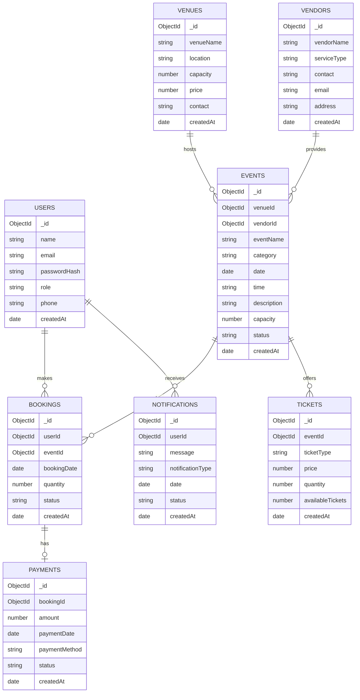

# Entity Relationship Diagram — Event Management System

This document represents the database relationships between the main entities of the Event Management System.

## ER Diagram

## Relationship Summary

| Relationship | Cardinality | Description |
|---|---:|---|
| User → Bookings | 1 : N | A user can make multiple bookings. |
| Event → Bookings | 1 : N | An event can have multiple bookings. |
| Venue → Events | 1 : N | A venue can host multiple events. |
| Vendor → Events | 1 : N | A vendor can provide services for multiple events. |
| Event → Tickets | 1 : N | An event can offer multiple ticket types. |
| Booking → Payment | 1 : 1 | A booking can have one payment record. |
| User → Notifications | 1 : N | A user can receive multiple notifications. |

## Entity Description

### Users

Stores information about system users, including administrators, organizers, and participants.

### Events

Stores event information such as event name, category, date, time, venue, vendor, capacity, and status.

### Venues

Stores information about locations where events are hosted, including capacity, price, address, and contact details.

### Bookings

Stores participant booking information for events, including booking quantity, booking date, and booking status.

### Tickets

Stores ticket information for events, including ticket type, price, total quantity, and available tickets.

### Payments

Stores payment information related to event bookings, including amount, payment method, payment date, and payment status.

### Vendors

Stores information about vendors who provide services for events.

### Notifications

Stores notifications sent to users, including notification message, type, date, and read/unread status.

## Database Technology

The Event Management System uses **MongoDB** as its database. Each entity is represented as a MongoDB collection, and relationships between collections are maintained using `ObjectId` references.

### Collections

1. `Users`
2. `Events`
3. `Venues`
4. `Bookings`
5. `Tickets`
6. `Payments`
7. `Vendors`
8. `Notifications`