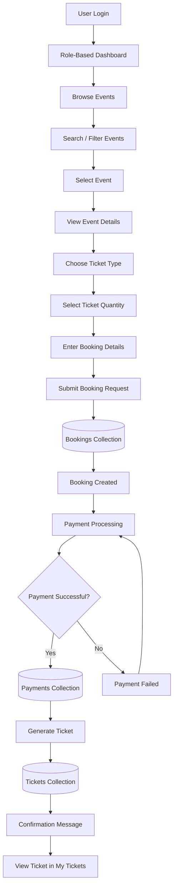
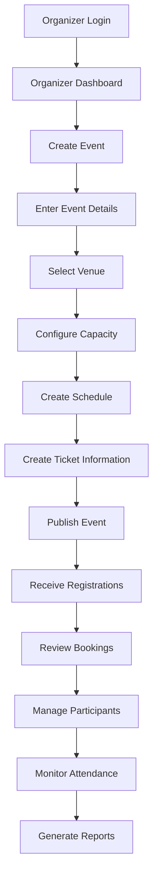
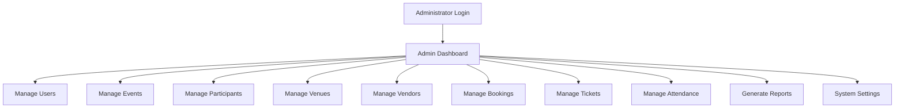
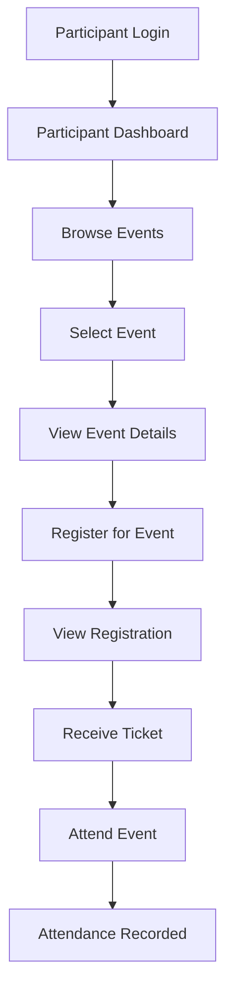
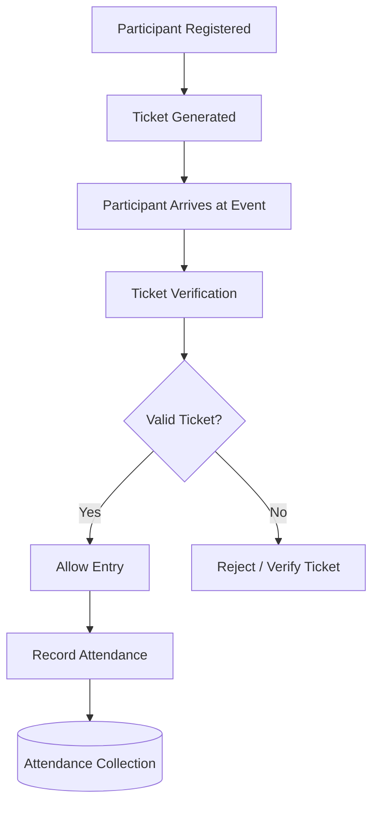
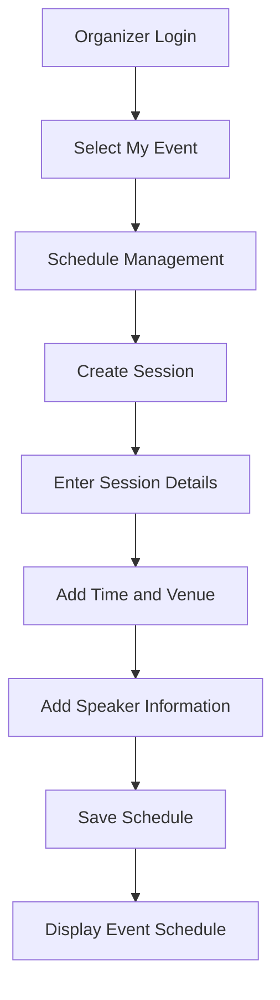
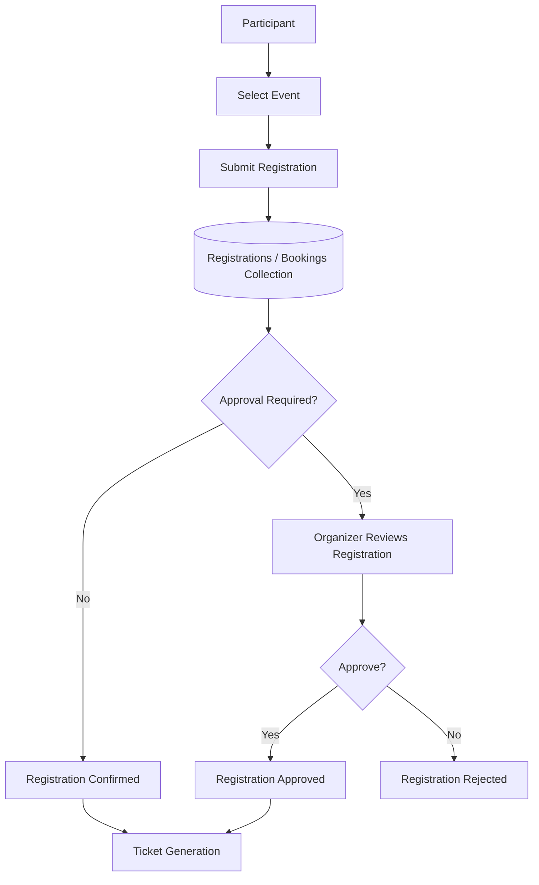
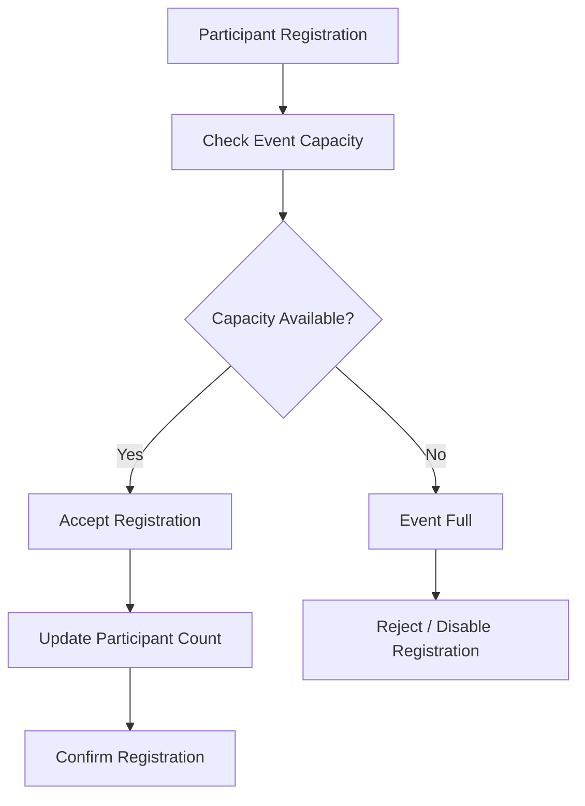
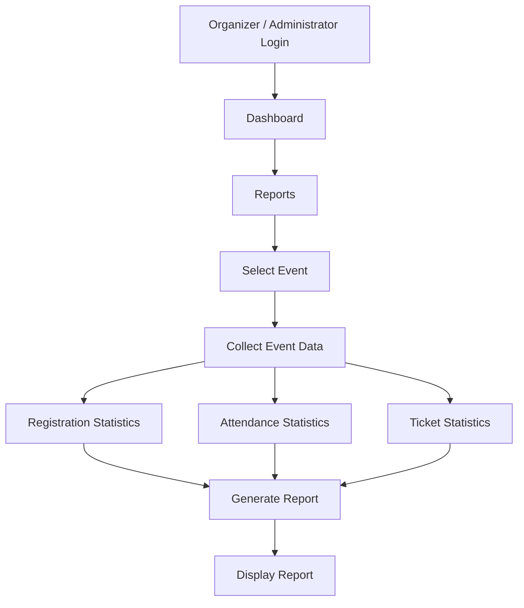
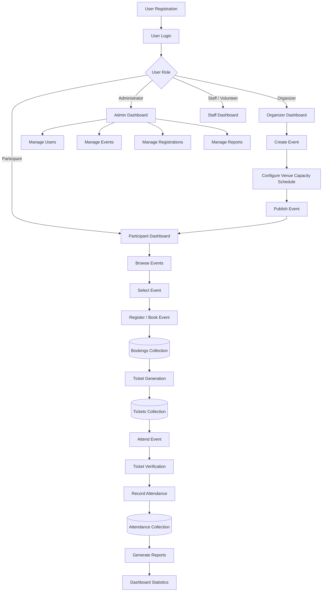

# Application Workflow — Event Management System

This document describes the main workflow of the Event Management System, from user login and event browsing to registration, payment, ticket generation, and confirmation.

---

## 1. Main Event Booking Workflow



---

## 2. Step-by-Step Booking Workflow

### Step 1 — User Login

The user enters their email and password to access the Event Management System.

```text
Login
  │
  ▼
Authentication
  │
  ▼
Role Verification
```

The system authenticates the user and provides access according to the user's role.

---

### Step 2 — Role-Based Dashboard

After successful login, the user is redirected to the appropriate dashboard.

```text
                 Login
                   │
                   ▼
             Authentication
                   │
                   ▼
            Select User Role
                   │
       ┌───────────┼───────────┬───────────────┐
       ▼           ▼           ▼               ▼
 Administrator  Organizer  Participant   Staff/Volunteer
```

Each role has different navigation options and permissions.

---

### Step 3 — Browse Events

The participant opens **Browse Events** and views the available events.

The participant can:

- Search events
- Filter events
- View event categories
- View event dates
- View event capacity
- Open event details

---

### Step 4 — Select Event

The participant selects an event from the event listing.

The event details page displays:

- Event name
- Category
- Date
- Time
- Venue
- Description
- Capacity
- Available tickets

---

### Step 5 — Choose Ticket

The participant selects the required ticket type and quantity.

```text
Event Details
      │
      ▼
Ticket Type
      │
      ▼
Ticket Quantity
      │
      ▼
Booking Details
```

---

### Step 6 — Submit Booking

The participant submits the booking request.

The frontend sends the booking information to the backend.

```text
POST /api/bookings
```

The booking contains information such as:

- User
- Event
- Booking date
- Ticket quantity
- Booking status

---

### Step 7 — Update Bookings Collection

After successful booking submission, a new booking document is stored in the MongoDB `Bookings` collection.

```text
Participant
     │
     ▼
Booking Request
     │
     ▼
Backend API
     │
     ▼
Bookings Collection
```

The booking status can be:

- `pending`
- `confirmed`
- `cancelled`

---

### Step 8 — Payment Processing

After the booking is created, the participant proceeds to payment.

```text
Booking Created
      │
      ▼
Payment Processing
      │
      ▼
Payment Status
```

> Online payment gateway integration is outside the required project scope. Payment functionality can therefore be represented as a planned or optional workflow if it is not implemented.

---

### Step 9 — Update Payments Collection

If payment functionality is implemented, payment information is stored in the `Payments` collection.

The payment record may contain:

- Booking ID
- Amount
- Payment date
- Payment method
- Payment status

---

### Step 10 — Ticket Generation

After a successful booking and payment process, a ticket is generated for the participant.

```text
Successful Booking
        │
        ▼
Payment Confirmation
        │
        ▼
Ticket Generation
        │
        ▼
Tickets Collection
```

The participant can access the ticket from **My Tickets**.

---

### Step 11 — Confirmation

The system displays a confirmation message to the participant.

```text
Ticket Generated
      │
      ▼
Confirmation Message
      │
      ▼
My Tickets
```

---

# 3. Event Organizer Workflow

The organizer is responsible for creating and managing events.



## Organizer Steps

1. Login to the system.
2. Open the Organizer Dashboard.
3. Create a new event.
4. Enter event information.
5. Select or assign a venue.
6. Configure event capacity.
7. Create event schedules and sessions.
8. Configure ticket information.
9. Publish the event.
10. Receive participant registrations.
11. Manage bookings.
12. Monitor participants and attendance.
13. Generate event reports.

---

# 4. Administrator Workflow

The administrator manages users and system-level information.



## Administrator Responsibilities

- Manage users
- Manage roles
- Manage events
- Manage participants
- Manage venues
- Manage vendors
- Manage bookings
- Manage tickets
- Monitor attendance
- Generate reports
- Manage system settings

---

# 5. Participant Workflow



## Participant Steps

1. Login.
2. Open Participant Dashboard.
3. Browse available events.
4. Select an event.
5. View event details.
6. Register for the event.
7. View registration status.
8. Access the generated ticket.
9. Attend the event.
10. Attendance is recorded.

---

# 6. Attendance Workflow

The attendance workflow is used to record whether registered participants attend an event.



## Attendance Steps

1. Participant registers for an event.
2. Ticket is generated.
3. Participant arrives at the event.
4. Staff verifies the ticket.
5. System checks the ticket.
6. Valid participants are allowed entry.
7. Attendance is recorded.
8. Attendance information is stored for reporting.

---

# 7. Schedule Management Workflow

Organizers can create and manage sessions for an event.



## Schedule Information

A schedule session can contain:

- Session title
- Date
- Start time
- End time
- Venue
- Speaker information
- Session description

---

# 8. Registration Management Workflow



## Registration Status

The registration system can maintain statuses such as:

- `pending`
- `confirmed`
- `cancelled`

Approval-based registration can be implemented as an optional feature.

---

# 9. Event Capacity Workflow

The system monitors the number of registered participants against the event capacity.



This helps prevent registrations from exceeding the configured event capacity.

---

# 10. Reporting Workflow



Reports can provide information such as:

- Total registrations
- Confirmed registrations
- Cancelled registrations
- Event capacity
- Ticket availability
- Attendance count
- Participant information

---

# 11. Complete System Workflow

The complete Event Management System workflow can be summarized as follows:



---

# 12. Main Workflow Summary

| Step | Activity | Main User |
|---|---|---|
| 1 | User Registration | All Users |
| 2 | User Login | All Users |
| 3 | Role Verification | System |
| 4 | Dashboard Access | All Users |
| 5 | Create Event | Organizer |
| 6 | Configure Capacity and Schedule | Organizer |
| 7 | Publish Event | Organizer |
| 8 | Browse Events | Participant |
| 9 | Register for Event | Participant |
| 10 | Store Registration | System |
| 11 | Generate Ticket | System |
| 12 | Attend Event | Participant |
| 13 | Verify Ticket | Staff / Volunteer |
| 14 | Record Attendance | Staff / Volunteer |
| 15 | Monitor Statistics | Organizer / Administrator |
| 16 | Generate Reports | Organizer / Administrator |

---

## Document Information

**Project:** Event Management System  
**Technology:** MERN Stack  
**Document:** Application Workflow  
**File Location:** `docs/design/workflow.md`